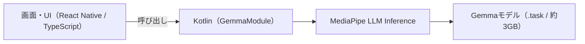

# Gemma-3n をスマホ単体で動かすVLMアプリを作ってみた（クラウド送信ゼロ）

スマホのカメラで撮った写真を、**クラウドに一切送らず、端末の中だけ**でAIに解析させるアプリを作ってみました。

Google のAIモデル **Gemma-3n** を Android のスマホ上でオンデバイス実行する、React Native 製のアプリです。テキストチャットと、カメラ画像の解析ができます。

推しポイントは、**AIモデルそのものをスマホの中に入れて、端末の中だけで推論している**こと（いわゆるオンデバイスAI）です。おかげで、**プライバシーが守られる**（写真も文章も外に出ない）／**オフラインで動く**／**API料金ゼロ**、という3拍子がそろっています。「クラウドに送らないと無理でしょ」と思われがちなAIが手元のスマホで動く、というのが個人的にいちばん面白かったところです。

コードは GitHub に置いてあります（MIT ライセンス）。
https://github.com/kaze-uta/unofficial-gemma-vlm-android

> このアプリは個人が趣味で作った**非公式**のもので、Google とは一切関係ありません（提携・後援・承認なし）。"Gemma" は Google LLC の商標です。

---

## 1. きっかけ

最近のAIはほとんどがクラウド型で、入力した文章や画像はいったん事業者のサーバーに送られて処理されます。便利なんですが、「写真をどこかに送る」というのが地味に引っかかる場面もあるなと思っていました。

そんなとき、Google が **Gemma-3n** という、スマホでも動くサイズのVLM（画像も読めるAIモデル）を出しているのを知りました。「これ、スマホの中だけで完結するAIアプリが作れるんじゃない？」と思ったのがきっかけです。

実際に作ってみたら、**通信ゼロ・オフラインで画像解析ができる**ものができたので紹介します。

---

## 2. 作ったもの

できたものがこちらです。


起動するとモード選択画面が出ます。機能はシンプルに2つだけにしました。


**テキストチャット** … Gemma に自由に質問できます。使い心地は普通のチャットAIと同じですが、全部スマホの中で完結します。


**カメラ画像解析** … 撮った写真をその場でAIが解析します。「この画像に写っているものを説明して」のように質問を添えて撮影すると、端末の中で考えて答えを返してくれます。


---

## 3. 技術スタックと構成

使った技術はこんな感じです。

| 項目 | 内容 |
|---|---|
| フレームワーク | React Native 0.84 + Expo 55 |
| 推論エンジン | MediaPipe LLM Inference 0.10.33 |
| モデル | `gemma-3n-e2b-it-int4`（約 3GB） |
| カメラ | react-native-vision-camera 4.7 |
| 対応OS | Android 7.0 (API 24) 以上 |

処理の流れを図にすると、こうなります。



画面まわりは React Native（JavaScript/TypeScript）、実際にAIを動かす重い処理は Kotlin のネイティブモジュールに任せる、という役割分担です。AIを動かすエンジンには Google公式の **MediaPipe LLM Inference** を使いました。これのおかげで、3GBあるGemmaモデルをスマホで推論できています。

---

## 4. 実装で工夫したところ

全コードは GitHub にありますが、ここでは特にキモになった4つを紹介します。

### 5.1. JS から Kotlin を呼ぶ橋渡し

JS 側からは、こんなインターフェースでネイティブの機能を呼びます（`src/native/GemmaModule.ts`）。

```typescript
interface GemmaModuleType {
  isExternalStorageManager(): Promise<boolean>;
  openStorageSettings(): Promise<boolean>;
  initializeModel(modelPath: string): Promise<boolean>;
  generateResponse(prompt: string): Promise<string>;
  generateResponseWithImage(prompt: string, imagePath: string): Promise<string>;
}
```

中心は、モデルを準備する `initializeModel`、文章で答える `generateResponse`、画像つきで答える `generateResponseWithImage` の3つ。JS からは普通の非同期関数を呼ぶだけで、裏側で Kotlin がAIを動かしてくれます。

### 5.2. GPUがダメならCPUに切り替える

オンデバイスAIで地味に大事なのが「どの端末でも落ちずに動く」ことです。GPUで動かせれば速いんですが、端末によってはGPUの初期化に失敗します。そこで、まずGPUで試して、ダメだったらCPUに切り替えるようにしました（`GemmaModule.kt`）。

```kotlin
val inference = try {
    val gpuOptions = LlmInference.LlmInferenceOptions.builder()
        .setModelPath(modelPath)
        .setMaxTokens(512)
        .setMaxNumImages(1)
        .setPreferredBackend(LlmInference.Backend.GPU)
        .build()
    LlmInference.createFromOptions(reactApplicationContext, gpuOptions)
} catch (e: Exception) {
    // GPUがダメだったらCPUにフォールバック
    val cpuOptions = LlmInference.LlmInferenceOptions.builder()
        .setModelPath(modelPath)
        .setMaxTokens(512)
        .setMaxNumImages(1)
        .setPreferredBackend(LlmInference.Backend.CPU)
        .build()
    LlmInference.createFromOptions(reactApplicationContext, cpuOptions)
}
```

### 5.3. 画像をAIに渡す（VLMの本番）

画像を扱うときは、テキストとは違って「画像も読めるようにしたセッション」を作ってから画像を渡します。

```kotlin
val sessionOptions = LlmInferenceSession.LlmInferenceSessionOptions.builder()
    .setGraphOptions(
        GraphOptions.builder()
            .setEnableVisionModality(true)   // 画像入力をオンにする
            .build()
    )
    .build()
val session = LlmInferenceSession.createFromOptions(inference, sessionOptions)

val mpImage = BitmapImageBuilder(bitmap).build()
session.addQueryChunk(prompt)   // テキストの質問
session.addImage(mpImage)       // 画像を追加
val result = session.generateResponse()
```

質問の文章（プロンプト）は、Gemma が決めた形式に合わせて組み立てます。途中の `<image>` が「ここに画像が入る」という目印です。

```typescript
const prompt =
  `<start_of_turn>user\n<image>\n${IMAGE_SYSTEM_PROMPT}\n\n${userPrompt.trim()}` +
  `<end_of_turn>\n<start_of_turn>model\n`;
```

### 5.4. メモリとの戦い

3GBのモデルに加えて画像まで載せると、スマホのメモリはけっこうカツカツになります。ここが実機で動かすときのいちばんのリアルでした。工夫を2つ入れています。

**その1：画像を最初から小さく読み込む。** フル解像度の写真をいったん全部メモリに乗せてから縮小するのではなく、`inSampleSize` を使って読み込む段階で512px以下まで縮めてしまいます（`GemmaModule.kt`）。これでピーク時のメモリ使用量がだいぶ減ります。

```kotlin
// ① まず画像のサイズ情報だけ取る（中身はまだ読まない）
val opts = BitmapFactory.Options().apply { inJustDecodeBounds = true }
BitmapFactory.decodeFile(imagePath, opts)

// ② どれくらい縮めるか計算（2の累乗で）
var sampleSize = 1
var w = opts.outWidth
var h = opts.outHeight
while (w > maxSize || h > maxSize) {
    sampleSize *= 2; w /= 2; h /= 2
}

// ③ 縮めながら読み込む
val decodeOpts = BitmapFactory.Options().apply {
    inSampleSize = sampleSize
    inPreferredConfig = Bitmap.Config.ARGB_8888  // MediaPipe は ARGB_8888 が必須
}
```

**その2：解析している間はカメラを止める。** カメラのプレビューとAIの推論が同時にGPUやメモリを取り合うと不安定になるので、解析中はカメラを止めるようにしました（`App.tsx`）。

```tsx
<Camera
  ref={camera}
  style={StyleSheet.absoluteFill}
  device={device}
  isActive={!isProcessing}   // 解析中はプレビューを止めて、GPU/メモリの取り合いを防ぐ
  photo={true}
/>
```

---

## 5. 動かす手順

手元で試してみたい方向けに、要点だけ書いておきます（細かいところは [README](https://github.com/kaze-uta/unofficial-gemma-vlm-android) を見てください）。

用意するもの：**Android の実機**（USBデバッグをオンに）/ **Node.js 22+** / **Android Studio**（`adb` 同梱）

```bash
# 1. クローンして依存関係をインストール
git clone https://github.com/kaze-uta/unofficial-gemma-vlm-android.git
cd unofficial-gemma-vlm-android
npm install
```

モデルファイルはライセンスの都合でリポジトリには入れていないので、自分でダウンロードします（無料）。[Kaggle Models の Gemma-3n](https://www.kaggle.com/models/google/gemma-3n/tfLite/gemma-3n-e2b-it-int4) から `gemma-3n-e2b-it-int4` を取得して展開すると、`gemma-3n-E2B-it-int4.task`（約3GB）が出てきます。

```bash
# 2. モデルをスマホに転送（USBでつないだ状態で。数分かかります）
adb push gemma-3n-E2B-it-int4.task /storage/emulated/0/gemma-3n-E2B-it-int4.task

# 3. ビルドして起動
npx expo run:android
```

> つまずきやすいポイント：Android 11以降だと初回起動時に「全ファイルへのアクセス」の許可を求められます。3GBのモデルを読むために必要なので、許可したらアプリを再起動してください。

---

## 6. 動かしてみた感想と今後

- 最初の起動に1〜2分かかります。3GBを読み込むので、ここはぐっと我慢。
- メモリが少ない端末だとGPU初期化に失敗してCPUに切り替わります。動きますが、ちょっと遅めです。
- 画像解析は、身近なものなら「何が写っているか」をちゃんと言葉で説明してくれます。通信ゼロでここまでやれるのは触っていて楽しいです。
- 一方でメモリの要求はそれなりに高め。オンデバイスAIは「端末スペックとの戦い」でもあるなと実感しました。

今後やってみたいこと：

- 会話の履歴を覚えておく（マルチターン対応）
- iOS への対応
- 別のモデルに差し替えてみる

---

## 7. まとめ

ちょっと前なら「AIモデルをスマホ単体で動かす？」という話だったのが、Gemma-3n と MediaPipe の組み合わせで、個人でもここまでできるようになりました。クラウドに頼らないのでプライバシーもオフライン性も両立できる、というのはこれから価値が出てくる気がしています。

リポジトリはこちらです（MIT ライセンス）。気になった方はぜひ動かしてみてください。
https://github.com/kaze-uta/unofficial-gemma-vlm-android

> あらためて：このアプリは個人開発の**非公式**プロジェクトで、Google とは一切関係ありません。"Gemma" は Google LLC の商標です。モデルを使う際は [Gemma Terms of Use](https://ai.google.dev/gemma/terms) に従ってください。コードは MIT License です。
